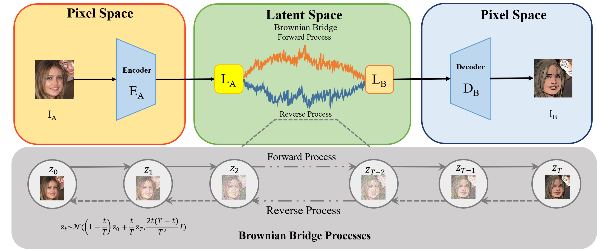
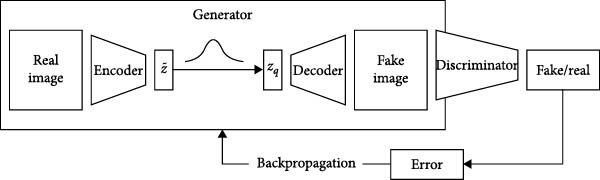

# LBBDM Based Diffusion with Multi-Branch Encoder - VQGAN for Image Translation [](https://colab.research.google.com/drive/1KXO6yasHnyR_QJUmY4nnaUYxS3fZYyuE?usp=sharing)
***
## Latent Brownian Bridge Diffusion Model (LBBDM) Architecture


## Vector Quantized Generative Adversarial Network (VQGAN) Architecture


## Clone the repo
```commandline
git clone https://github.com/RAGAV203/MSEVQQ.git
```
## Requirements
```commandline
cond env create -f environment.yml
conda activate BBDM
```

## Data preparation
### Paired translation task
For datasets that have paired image data, the path should be formatted as:
```yaml
your_dataset_path/train/A  # training reference
your_dataset_path/train/B  # training ground truth
your_dataset_path/val/A  # validating reference
your_dataset_path/val/B  # validating ground truth
your_dataset_path/test/A  # testing reference
your_dataset_path/test/B  # testing ground truth
```
After that, the dataset configuration should be specified in config file as:
```yaml
dataset_name: 'your_dataset_name'
dataset_type: 'custom_aligned'
dataset_config:
  dataset_path: 'your_dataset_path'
```

## Train and Test
### Specify your configuration file
Modify the configuration file based on our templates in <font color=violet><b>configs/Template-*.yaml</b></font>  
The template of BBDM in pixel space are named <font color=violet><b>Template-BBDM.yaml</b></font> that can be found in **configs/** and <font color=violet><b>Template-LBBDM-f4.yaml Template-LBBDM-f8.yaml Template-LBBDM-f16.yaml</b></font> are templates for latent space BBDM with latent depth of 4/8/16. 

Don't forget to specify your VQGAN checkpoint path and dataset path.
### Specity your training and tesing shell
Specity your shell file based on our templates in <font color=violet><b>configs/Template-shell.sh</b></font>

If you wish to train from the beginning
```commandline
python3 main.py --config configs/Template_LBBDM_f4.yaml --train --sample_at_start --save_top --gpu_ids 0 
```

If you wish to continue training, specify the model checkpoint path and optimizer checkpoint path in the train part.
```commandline
python3 main.py --config configs/Template_LBBDM_f4.yaml --train --sample_at_start --save_top --gpu_ids 0 
--resume_model path/to/model_ckpt --resume_optim path/to/optim_ckpt
```

If you wish to sample the whole test dataset to evaluate metrics
```commandline
python3 main.py --config configs/Template_LBBDM_f4.yaml --sample_to_eval --gpu_ids 0 --resume_model path/to/model_ckpt
```

Note that optimizer checkpoint is not needed in test and specifying checkpoint path in commandline has higher priority than specifying in configuration file.

For distributed training, just modify the configuration of **--gpu_ids** with your specified gpus. 
```commandline
python3 main.py --config configs/Template_LBBDM_f4.yaml --sample_to_eval --gpu_ids 0,1,2,3 --resume_model path/to/model_ckpt
```
